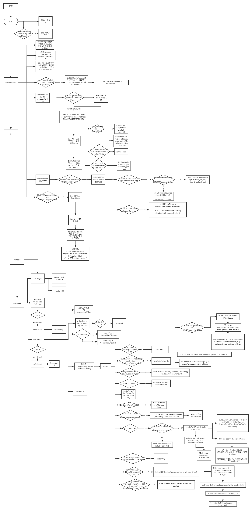

# bitcask

a log-structured hash table for fast key/value data with golang

## 项目目标

1. 学习bitcask模型
2. 学习rosedb，nustdb等实现
3. KV存储入门

references:

[rosedb](https://github.com/flower-corp/rosedb)

[minidb](git@github.com:flower-corp/minidb.git)

[nustdb](github.com/xujiajun/nutsdb)

[从零实现一个 k-v 存储引擎](https://mp.weixin.qq.com/s/s8s6VtqwdyjthR6EtuhnUA)

[优雅的Bitcask/BeansDB](https://zhuanlan.zhihu.com/p/53682577)

## 流程图

### nustdb流程图

